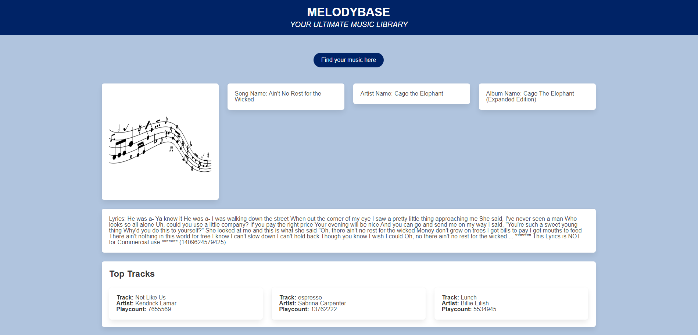

# Melodybase

## Description

This project was completed for the Columbia Coding Bootcamp. We worked as a group to create a page that can display information about a searched song based on the name of the song and the name of the artist. The page displayed the name of the album the song is from and lyrics from the song. Additionally, the current top 3 songs on the charts are shown at the bottom of the page.

## Installation

N/A

## Usage

This project can be accessed on Git Pages at the following URL: [https://jocoso.github.io/melodybase/](https://jocoso.github.io/melodybase/).

## Credits

Worked on by jocoso, boamarant, and muktadir1090. We used the Musixmatch API for accessing the album name and lyrics, the Last.fm API for the top tracks on the charts, the Bulma CSS framework for styling, and Jquery for JS functionality. 

## Features

The "Find your music here" button will pull up a modal form for the user to input the name of a song that they searched for. After entering a valid song, the song name, artist name, album name, and lyrics will be displayed on the page. There is also a static feature at the bottom of the page that shows the current top 3 songs on the charts. This is updated when the chart positions change.

## Screenshot of Application

